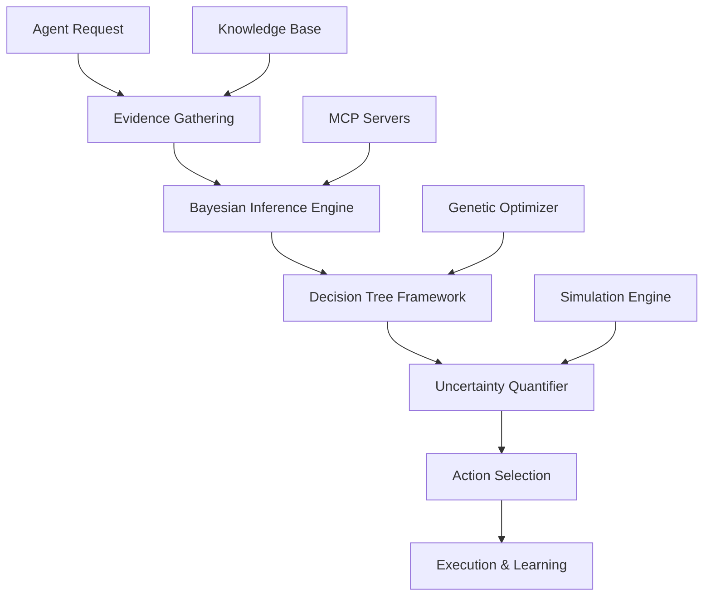

# Agent Reasoning System

**Framework:** Agentical Multi-Agent Framework  
**Component:** Task 5 - Agent Reasoning System  
**Version:** 1.0.0  
**Status:** Production Ready (33% Complete - Bayesian Core Implemented)  
**Last Updated:** 2025-01-12  

---

## 📋 Table of Contents

1. [Overview](#overview)
2. [Architecture](#architecture)
3. [Core Components](#core-components)
4. [Usage Patterns](#usage-patterns)
5. [Integration Guide](#integration-guide)
6. [API Reference](#api-reference)
7. [Examples](#examples)
8. [Performance Considerations](#performance-considerations)
9. [Best Practices](#best-practices)
10. [Troubleshooting](#troubleshooting)

---

## 📖 Overview

The Agent Reasoning System is a sophisticated probabilistic decision-making engine that enables Agentical agents to make intelligent decisions under uncertainty. It provides mathematical frameworks for reasoning, learning, and optimization that transform reactive agents into intelligent decision-makers.

### **What It Does**

- **Probabilistic Decision Making**: Uses Bayesian inference to make decisions with quantified uncertainty
- **Dynamic Belief Updating**: Continuously learns and adapts based on new evidence
- **Multi-Criteria Optimization**: Evaluates complex decisions using multiple criteria and constraints
- **Uncertainty Quantification**: Provides confidence measures and risk assessments
- **Experience Learning**: Improves decision quality through historical data analysis

### **Why It Matters**

Traditional rule-based agents follow predetermined logic paths. The Reasoning System enables agents to:

- Handle ambiguous situations intelligently
- Learn from experience and improve over time
- Provide transparent reasoning with confidence levels
- Coordinate decisions across multiple agents
- Optimize outcomes in complex scenarios

---

## 🏗️ Architecture

### **System Overview**



### **Component Hierarchy**

```
Agent Reasoning System
├── Core Reasoning Engine
│   ├── Bayesian Inference Engine ✅
│   ├── Decision Tree Framework ✅
│   ├── Uncertainty Quantifier ✅
│   └── Belief Updater ✅
├── Optimization Components
│   ├── Genetic Algorithm Optimizer 🔄
│   └── Simulation Engine ⏳
└── Integration Layer
    ├── MCP Server Integration ✅
    ├── Agent Architecture Integration ✅
    └── Observable Pattern Integration ✅
```

**Legend:**

- ✅ **Completed** (Production Ready)
- 🔄 **In Progress** (Task 5.2)
- ⏳ **Planned** (Task 5.3)

---

## 🧠 Core Components

### **1. Bayesian Inference Engine** ✅

The heart of the reasoning system, providing probabilistic inference capabilities.

**Key Features:**

- Multiple inference methods (exact, variational, MCMC)
- Dynamic belief updating using Bayes' theorem
- Hypothesis evaluation and ranking
- Evidence processing with reliability weighting
- Performance optimization through caching

**Data Structures:**
```python
@dataclass
class Evidence:
    id: str
    name: str
    value: Union[float, bool, str, Dict[str, Any]]
    likelihood: float          # P(evidence|hypothesis)
    reliability: float         # Confidence in evidence quality
    source: str               # Evidence source identifier
    timestamp: datetime
    metadata: Dict[str, Any]

@dataclass
class Hypothesis:
    id: str
    name: str
    description: str
    prior_probability: float   # P(hypothesis)
    posterior_probability: float  # P(hypothesis|evidence)
    likelihood_function: Optional[Callable]
    status: HypothesisStatus
    confidence_level: float
```

**Core Operations:**
```python
# Update belief based on new evidence
result = await bayesian_engine.update_belief(hypothesis, evidence)

# Batch processing for multiple hypotheses
results = await bayesian_engine.batch_inference(hypotheses, evidence_sets)

# Compare multiple hypotheses
ranking = await bayesian_engine.rank_hypotheses(hypotheses, evidence)
```

### **2. Decision Tree Framework** ✅

Structured decision-making with uncertainty propagation through decision paths.

**Key Features:**

- Multi-criteria decision analysis
- Uncertainty propagation through decision chains
- Dynamic tree modification and pruning
- Support for various decision criteria (expected value, utility, minimax regret)
- Real-time decision optimization

**Decision Criteria:**

- **Maximum Expected Value**: Choose option with highest expected outcome
- **Expected Utility**: Incorporate risk preferences and utility functions
- **Minimax Regret**: Minimize maximum possible regret
- **Satisficing**: Find first option meeting minimum criteria

**Usage Example:**
```python
# Create decision tree for deployment strategy
decision_tree = DecisionTree(
    root_node=DecisionNode(
        name="deployment_strategy",
        node_type=NodeType.DECISION,
        options=["blue_green", "canary", "rolling"]
    )
)

# Evaluate options with uncertainty
outcomes = await decision_tree.evaluate_options(
    criteria=DecisionCriteria.EXPECTED_UTILITY,
    risk_tolerance=0.7
)

# Select optimal decision
best_option = decision_tree.select_optimal_path(outcomes)
```

### **3. Uncertainty Quantifier** ✅

Comprehensive uncertainty analysis and confidence measurement.

**Uncertainty Types:**

- **Aleatory**: Natural randomness in the system
- **Epistemic**: Uncertainty due to lack of knowledge  
- **Parametric**: Uncertainty in model parameters
- **Model**: Uncertainty about model structure

**Quantification Methods:**
```python
# Confidence interval estimation
confidence_interval = await uncertainty_quantifier.estimate_confidence_interval(
    data=inference_results,
    confidence_level=0.95
)

# Uncertainty decomposition
uncertainty_breakdown = await uncertainty_quantifier.decompose_uncertainty(
    prediction=model_output,
    sources=["aleatory", "epistemic", "parametric"]
)

# Risk assessment
risk_profile = await uncertainty_quantifier.assess_risk(
    outcomes=decision_outcomes,
    risk_factors=environmental_factors
)
```

### **4. Belief Updater** ✅

Dynamic belief management with convergence detection and stability analysis.

**Key Features:**

- Real-time belief updating
- Convergence detection for stable beliefs
- Belief decay for time-sensitive information
- Multi-source belief fusion
- Belief conflict resolution

**Core Operations:**
```python
# Continuous belief updating
async def update_beliefs_continuously(self, evidence_stream):
    async for evidence in evidence_stream:
        updated_beliefs = await self.belief_updater.update(
            current_beliefs=self.current_beliefs,
            new_evidence=evidence,
            decay_rate=0.1
        )
        
        # Check for convergence
        if self.belief_updater.has_converged(updated_beliefs):
            break
            
        self.current_beliefs = updated_beliefs
```

### **5. Genetic Algorithm Optimizer** 🔄 (In Progress)

Evolutionary optimization for complex problem spaces and agent strategy evolution.

**Planned Features:**

- Multi-objective optimization
- Population-based strategy evolution
- Fitness function framework
- Integration with Darwin-MCP server
- Performance optimization for large solution spaces

### **6. Simulation Engine** ⏳ (Planned)

Monte Carlo simulation for scenario analysis and prediction.

**Planned Features:**

- Monte Carlo simulation capabilities
- Scenario modeling and analysis
- Prediction engines with uncertainty bounds
- Stress testing and sensitivity analysis
- Statistical outcome analysis

---

## 🎯 Usage Patterns

### **Pattern 1: Real-Time Decision Making**

**Scenario**: Agent needs to make immediate decisions with available information.

```python
class CodeAgent(EnhancedBaseAgent):
    async def prioritize_code_reviews(self, pull_requests: List[PullRequest]):
        with logfire.span("code_review_prioritization"):
            # Gather evidence about each PR
            evidence_sets = []
            for pr in pull_requests:
                evidence = Evidence(
                    name=f"pr_{pr.id}_metrics",
                    value={
                        "lines_changed": pr.lines_changed,
                        "complexity_score": pr.complexity,
                        "author_experience": pr.author.experience_level,
                        "test_coverage": pr.test_coverage,
                        "critical_files_modified": pr.critical_files_count
                    },
                    likelihood=self._calculate_likelihood(pr),
                    reliability=0.9,
                    source="static_analysis"
                )
                evidence_sets.append(evidence)
            
            # Create hypotheses for risk assessment
            hypotheses = [
                Hypothesis(
                    name=f"pr_{pr.id}_high_risk",
                    description=f"PR {pr.id} has high risk of introducing bugs",
                    prior_probability=self._get_historical_risk_rate(pr.author)
                )
                for pr in pull_requests
            ]
            
            # Perform Bayesian inference
            results = await self.reasoning_engine.batch_inference(
                hypotheses, evidence_sets
            )
            
            # Rank PRs by risk probability
            prioritized_prs = sorted(
                pull_requests,
                key=lambda pr: results[f"pr_{pr.id}_high_risk"].posterior_probability,
                reverse=True
            )
            
            return prioritized_prs
```

### **Pattern 2: Multi-Agent Coordination**

**Scenario**: SuperAgent coordinating decisions across multiple specialist agents.

```python
class SuperAgent(EnhancedBaseAgent):
    async def coordinate_incident_response(self, incident: Incident):
        with logfire.span("incident_coordination"):
            # Gather assessments from specialist agents
            assessments = await asyncio.gather(
                self.infosec_agent.assess_security_risk(incident),
                self.devops_agent.assess_infrastructure_impact(incident),
                self.dba_agent.assess_data_integrity_risk(incident)
            )
            
            # Convert assessments to beliefs
            beliefs = [
                Hypothesis(
                    name=f"{agent_type}_severity_high",
                    posterior_probability=assessment.risk_probability,
                    confidence_level=assessment.confidence
                )
                for agent_type, assessment in zip(
                    ["security", "infrastructure", "data"], 
                    assessments
                )
            ]
            
            # Fuse beliefs using Bayesian combination
            combined_assessment = await self.reasoning_engine.fuse_beliefs(
                beliefs,
                fusion_method="jeffrey_rule",
                weight_by_confidence=True
            )
            
            # Create decision tree for response options
            response_tree = DecisionTree(
                root_node=DecisionNode(
                    name="incident_response",
                    options=[
                        "immediate_isolation",
                        "controlled_investigation", 
                        "monitoring_enhancement",
                        "normal_procedures"
                    ]
                )
            )
            
            # Evaluate response options
            response_outcomes = await response_tree.evaluate_options(
                severity_assessment=combined_assessment,
                available_resources=await self.get_available_resources(),
                business_constraints=await self.get_business_constraints()
            )
            
            # Select optimal response
            optimal_response = response_tree.select_optimal_path(
                response_outcomes,
                criteria=DecisionCriteria.MINIMAX_REGRET
            )
            
            return optimal_response
```

### **Pattern 3: Learning from Experience**

**Scenario**: Agent improving decision-making through outcome feedback.

```python
class DeploymentAgent(EnhancedBaseAgent):
    async def learn_from_deployment(self, deployment_result: DeploymentResult):
        with logfire.span("deployment_learning"):
            # Create evidence from actual outcome
            outcome_evidence = Evidence(
                name="deployment_outcome",
                value={
                    "success": deployment_result.success,
                    "performance_impact": deployment_result.performance_delta,
                    "error_rate": deployment_result.error_rate,
                    "rollback_required": deployment_result.rollback_required
                },
                likelihood=1.0,  # Actual outcome is certain
                reliability=1.0,
                source="deployment_metrics"
            )
            
            # Update deployment success model
            updated_model = await self.reasoning_engine.update_belief(
                self.deployment_success_hypothesis,
                outcome_evidence
            )
            
            # Update feature-specific beliefs
            for feature in deployment_result.features_deployed:
                feature_hypothesis = Hypothesis(
                    name=f"feature_{feature.id}_safe",
                    prior_probability=self.feature_risk_models.get(
                        feature.type, 0.7
                    )
                )
                
                feature_evidence = Evidence(
                    name=f"feature_{feature.id}_outcome",
                    value={
                        "feature_errors": feature.error_count,
                        "user_impact": feature.user_impact_score
                    },
                    likelihood=self._calculate_feature_likelihood(feature),
                    reliability=0.95
                )
                
                await self.reasoning_engine.update_belief(
                    feature_hypothesis, 
                    feature_evidence
                )
            
            # Persist learned knowledge
            await self.knowledge_base.store_deployment_learning(
                deployment_id=deployment_result.deployment_id,
                updated_beliefs=updated_model,
                learning_timestamp=datetime.utcnow()
            )
```

### **Pattern 4: Uncertainty-Aware Decision Making**

**Scenario**: Making decisions when confidence levels matter.

```python
class DatabaseAgent(EnhancedBaseAgent):
    async def recommend_query_optimization(self, query: SQLQuery):
        with logfire.span("query_optimization_reasoning"):
            # Analyze query characteristics
            query_evidence = Evidence(
                name="query_analysis",
                value={
                    "complexity_score": query.complexity,
                    "table_count": len(query.tables),
                    "join_count": query.join_count,
                    "subquery_count": query.subquery_count,
                    "index_usage": query.estimated_index_usage
                },
                reliability=0.8
            )
            
            # Generate optimization hypotheses
            optimization_hypotheses = [
                Hypothesis(
                    name="index_optimization_beneficial",
                    prior_probability=0.6
                ),
                Hypothesis(
                    name="query_rewrite_beneficial", 
                    prior_probability=0.4
                ),
                Hypothesis(
                    name="partitioning_beneficial",
                    prior_probability=0.3
                )
            ]
            
            # Perform inference
            optimization_results = await self.reasoning_engine.batch_inference(
                optimization_hypotheses, [query_evidence] * len(optimization_hypotheses)
            )
            
            # Quantify uncertainty for each recommendation
            recommendations = []
            for hypothesis_name, result in optimization_results.items():
                uncertainty = await self.uncertainty_quantifier.quantify_uncertainty(
                    posterior=result.posterior_probability,
                    evidence_strength=result.evidence_count,
                    prior_strength=10  # Based on historical data
                )
                
                # Only recommend if confidence is sufficient
                if uncertainty.confidence_level > 0.75:
                    recommendations.append({
                        "optimization_type": hypothesis_name,
                        "probability_beneficial": result.posterior_probability,
                        "confidence": uncertainty.confidence_level,
                        "expected_improvement": uncertainty.expected_value,
                        "uncertainty_bounds": uncertainty.confidence_interval
                    })
            
            return recommendations
```

---

## 🔗 Integration Guide

### **Integration with Agent Architecture**

The Reasoning System integrates seamlessly with the Agentical agent architecture:

```python
from agentical.agents.enhanced_base_agent import EnhancedBaseAgent
from agentical.reasoning.bayesian_engine import BayesianInferenceEngine
from agentical.reasoning.decision_tree import DecisionTree
from agentical.reasoning.uncertainty_quantifier import UncertaintyQuantifier

class ReasoningEnabledAgent(EnhancedBaseAgent):
    def __init__(self, config: AgentConfiguration, **kwargs):
        super().__init__(config, **kwargs)
        
        # Initialize reasoning components
        self.reasoning_engine = BayesianInferenceEngine(
            config=BayesianConfig(
                inference_method=InferenceMethod.VARIATIONAL,
                confidence_threshold=0.8,
                enable_caching=True
            ),
            logger=self.logger
        )
        
        self.decision_tree = DecisionTree(
            config=DecisionTreeConfig(
                max_depth=10,
                pruning_threshold=0.01
            )
        )
        
        self.uncertainty_quantifier = UncertaintyQuantifier(
            config=UncertaintyConfig(
                confidence_level=0.95,
                uncertainty_tolerance=0.2
            )
        )
    
    async def _execute_operation(self, context: ExecutionContext):
        """Override to include reasoning in operation execution."""
        
        # Standard reasoning workflow
        evidence = await self._gather_evidence(context)
        hypotheses = await self._generate_hypotheses(context)
        
        # Perform inference
        inference_results = await self.reasoning_engine.batch_inference(
            hypotheses, evidence
        )
        
        # Make decision
        decision = await self._make_decision(inference_results, context)
        
        # Execute and learn
        result = await self._execute_decision(decision)
        await self._learn_from_outcome(result, inference_results)
        
        return result
```

### **MCP Server Integration**

The system integrates with specialized MCP servers for advanced capabilities:

```python
# Bayes-MCP Server Integration
from agentical.reasoning.mcp_integration import BayesMCPClient

class AdvancedReasoningAgent(ReasoningEnabledAgent):
    def __init__(self, *args, **kwargs):
        super().__init__(*args, **kwargs)
        
        # Connect to Bayes-MCP server for advanced computations
        self.bayes_mcp = BayesMCPClient(
            server_url="http://localhost:8080",
            timeout=30.0,
            retry_attempts=3
        )
    
    async def perform_advanced_inference(self, complex_model: BayesianNetwork):
        """Use MCP server for computationally intensive inference."""
        
        try:
            # Delegate complex computations to specialized server
            result = await self.bayes_mcp.compute_inference(
                model=complex_model,
                evidence=self.current_evidence,
                method="variational_bayes",
                max_iterations=1000
            )
            
            return result
            
        except MCPServerError as e:
            # Fallback to local computation
            self.logger.warning(f"MCP server unavailable, using local: {e}")
            return await self.reasoning_engine.compute_inference_local(
                complex_model, self.current_evidence
            )
```

### **Database Integration**

Persistent storage of reasoning state and learned knowledge:

```python
# Repository pattern for reasoning persistence
from agentical.db.repositories.reasoning import ReasoningRepository

class PersistentReasoningAgent(ReasoningEnabledAgent):
    def __init__(self, *args, **kwargs):
        super().__init__(*args, **kwargs)
        self.reasoning_repo = ReasoningRepository(self.db_session)
    
    async def save_reasoning_state(self, inference_results: Dict[str, InferenceResult]):
        """Persist reasoning state for recovery and analysis."""
        
        reasoning_state = ReasoningState(
            agent_id=self.config.agent_id,
            session_id=self.current_session_id,
            inference_results=inference_results,
            beliefs=self.current_beliefs,
            evidence_processed=len(self.evidence_history),
            timestamp=datetime.utcnow()
        )
        
        await self.reasoning_repo.save_reasoning_state(reasoning_state)
    
    async def load_historical_beliefs(self, lookback_hours: int = 24):
        """Load historical beliefs for context."""
        
        historical_states = await self.reasoning_repo.get_recent_states(
            agent_id=self.config.agent_id,
            hours_back=lookback_hours
        )
        
        # Initialize beliefs from historical data
        for state in historical_states:
            self.belief_updater.incorporate_historical_beliefs(
                state.beliefs,
                age_hours=(datetime.utcnow() - state.timestamp).total_seconds() / 3600
            )
```

---

## 📚 API Reference

### **BayesianInferenceEngine**

#### **Core Methods**

```python
async def update_belief(
    self,
    hypothesis: Hypothesis,
    evidence: Evidence
) -> InferenceResult:
    """Update belief for a single hypothesis given evidence."""

async def batch_inference(
    self,
    hypotheses: List[Hypothesis],
    evidence_sets: List[List[Evidence]]
) -> Dict[str, InferenceResult]:
    """Perform inference for multiple hypotheses."""

async def rank_hypotheses(
    self,
    hypotheses: List[Hypothesis],
    evidence: List[Evidence]
) -> List[Tuple[Hypothesis, float]]:
    """Rank hypotheses by posterior probability."""

async def fuse_beliefs(
    self,
    beliefs: List[Hypothesis],
    fusion_method: str = "jeffrey_rule"
) -> Hypothesis:
    """Combine multiple beliefs into unified assessment."""
```

#### **Configuration**

```python
class BayesianConfig(BaseModel):
    inference_method: InferenceMethod = InferenceMethod.EXACT
    confidence_threshold: float = 0.75
    uncertainty_tolerance: float = 0.25
    max_iterations: int = 1000
    convergence_threshold: float = 1e-6
    enable_caching: bool = True
    cache_size: int = 1000
    timeout_seconds: float = 30.0
    parallel_processing: bool = True
    max_workers: int = 4
```

### **DecisionTree**

#### **Core Methods**

```python
async def evaluate_options(
    self,
    decision_node: DecisionNode,
    criteria: DecisionCriteria = DecisionCriteria.EXPECTED_VALUE,
    **context
) -> List[DecisionOutcome]:
    """Evaluate all options for a decision node."""

def select_optimal_path(
    self,
    outcomes: List[DecisionOutcome],
    risk_tolerance: float = 0.5
) -> DecisionOutcome:
    """Select optimal decision path."""

async def propagate_uncertainty(
    self,
    path: List[DecisionNode],
    uncertainty_sources: List[UncertaintyType]
) -> float:
    """Propagate uncertainty through decision path."""
```

### **UncertaintyQuantifier**

#### **Core Methods**

```python
async def quantify_uncertainty(
    self,
    posterior: float,
    evidence_strength: int,
    prior_strength: int = 1
) -> UncertaintyMeasure:
    """Quantify uncertainty in posterior probability."""

async def estimate_confidence_interval(
    self,
    data: List[float],
    confidence_level: float = 0.95
) -> Tuple[float, float]:
    """Estimate confidence interval for data."""

async def decompose_uncertainty(
    self,
    prediction: Any,
    sources: List[str]
) -> Dict[str, float]:
    """Decompose uncertainty by source."""
```

---

## 💡 Examples

### **Example 1: Simple Risk Assessment**

```python
async def assess_deployment_risk():
    # Initialize reasoning engine
    engine = BayesianInferenceEngine(BayesianConfig())
    
    # Define hypothesis
    hypothesis = Hypothesis(
        name="deployment_will_succeed",
        description="Deployment will complete without issues",
        prior_probability=0.8  # Historical success rate
    )
    
    # Gather evidence
    evidence = [
        Evidence(
            name="test_coverage",
            value={"coverage_percent": 95},
            likelihood=0.9,
            reliability=0.95
        ),
        Evidence(
            name="code_review_score", 
            value={"average_score": 4.2},
            likelihood=0.85,
            reliability=0.9
        )
    ]
    
    # Perform inference
    result = await engine.update_belief(hypothesis, evidence)
    
    print(f"Deployment success probability: {result.posterior_probability:.2f}")
    print(f"Confidence level: {result.confidence_level:.2f}")
    
    # Decision based on uncertainty
    if result.confidence_level > 0.8 and result.posterior_probability > 0.9:
        return "APPROVE_DEPLOYMENT"
    elif result.posterior_probability > 0.7:
        return "APPROVE_WITH_MONITORING"
    else:
        return "REQUIRE_ADDITIONAL_TESTING"
```

### **Example 2: Multi-Criteria Decision**

```python
async def select_scaling_strategy():
    # Create decision tree
    tree = DecisionTree()
    
    # Define scaling options
    scaling_options = [
        "horizontal_scaling",
        "vertical_scaling", 
        "hybrid_approach"
    ]
    
    # Evaluate each option
    outcomes = []
    for option in scaling_options:
        outcome = await tree.evaluate_option(
            option=option,
            criteria=[
                ("cost_efficiency", 0.4),      # 40% weight
                ("performance_gain", 0.35),    # 35% weight  
                ("implementation_speed", 0.25) # 25% weight
            ],
            constraints={
                "max_budget": 50000,
                "max_downtime_minutes": 30
            }
        )
        outcomes.append(outcome)
    
    # Select optimal strategy
    best_strategy = tree.select_optimal_path(
        outcomes,
        criteria=DecisionCriteria.EXPECTED_UTILITY
    )
    
    return {
        "recommended_strategy": best_strategy.option_name,
        "expected_value": best_strategy.expected_value,
        "confidence": best_strategy.confidence_level,
        "risk_factors": best_strategy.risk_assessment
    }
```

### **Example 3: Learning Loop Implementation**

```python
class LearningAgent(ReasoningEnabledAgent):
    def __init__(self, *args, **kwargs):
        super().__init__(*args, **kwargs)
        self.performance_history = []
        self.belief_models = {}
    
    async def execute_with_learning(self, operation: str, parameters: Dict):
        """Execute operation with learning feedback loop."""
        
        # 1. Pre-execution reasoning
        success_hypothesis = Hypothesis(
            name=f"{operation}_success",
            prior_probability=self._get_historical_success_rate(operation)
        )
        
        # Gather pre-execution evidence
        pre_evidence = await self._gather_pre_execution_evidence(
            operation, parameters
        )
        
        # Predict outcome
        prediction = await self.reasoning_engine.update_belief(
            success_hypothesis, pre_evidence
        )
        
        # 2. Execute operation
        start_time = datetime.utcnow()
        try:
            result = await self._execute_operation_core(operation, parameters)
            execution_success = True
        except Exception as e:
            result = {"error": str(e)}
            execution_success = False
        finally:
            execution_time = (datetime.utcnow() - start_time).total_seconds()
        
        # 3. Post-execution learning
        outcome_evidence = Evidence(
            name=f"{operation}_outcome",
            value={
                "success": execution_success,
                "execution_time": execution_time,
                "result_quality": self._assess_result_quality(result)
            },
            likelihood=1.0,  # Actual outcome
            reliability=1.0
        )
        
        # Update beliefs
        updated_belief = await self.reasoning_engine.update_belief(
            success_hypothesis, outcome_evidence
        )
        
        # Store learning
        self.performance_history.append({
            "operation": operation,
            "parameters": parameters,
            "prediction": prediction.posterior_probability,
            "actual_outcome": execution_success,
            "prediction_accuracy": abs(
                prediction.posterior_probability - (1.0 if execution_success else 0.0)
            ),
            "updated_model": updated_belief
        })
        
        # 4. Model improvement
        if len(self.performance_history) > 10:
            await self._improve_prediction_models()
        
        return result
    
    async def _improve_prediction_models(self):
        """Improve prediction models based on performance history."""
        
        # Analyze prediction accuracy
        recent_performance = self.performance_history[-50:]  # Last 50 operations
        accuracy = np.mean([p["prediction_accuracy"] for p in recent_performance])
        
        if accuracy < 0.8:  # If accuracy is below 80%
            # Retrain models with recent data
            await self._retrain_success_models(recent_performance)
            
        # Update prior probabilities based on recent success rates
        operation_stats = defaultdict(list)
        for perf in recent_performance:
            operation_stats[perf["operation"]].append(perf["actual_outcome"])
        
        for operation, outcomes in operation_stats.items():
            success_rate = np.mean(outcomes)
            self.belief_models[operation] = {
                "prior_probability": success_rate,
                "evidence_count": len(outcomes),
                "last_updated": datetime.utcnow()
            }
```

---

## 🚀 Performance Considerations

### **Computational Complexity**

**Bayesian Inference:**

- **Exact Methods**: O(n²) for simple models, exponential for complex networks
- **Variational Methods**: O(n log n) with good approximation quality  
- **MCMC Methods**: O(n × iterations) with convergence guarantees

**Decision Trees:**

- **Tree Construction**: O(n × d × log n) where n=options, d=criteria
- **Path Evaluation**: O(depth × branches)
- **Optimization**: O(n!) for exhaustive search, O(n log n) with heuristics

### **Optimization Strategies**

```python
# 1. Caching for repeated computations
class CachedBayesianEngine(BayesianInferenceEngine):
    def __init__(self, *args, **kwargs):
        super().__init__(*args, **kwargs)
        self.computation_cache = LRUCache(maxsize=1000)
    
    async def update_belief(self, hypothesis: Hypothesis, evidence: Evidence):
        # Create cache key
        cache_key = self._create_cache_key(hypothesis, evidence)
        
        # Check cache first
        if cache_key in self.computation_cache:
            return self.computation_cache[cache_key]
        
        # Compute and cache result
        result = await super().update_belief(hypothesis, evidence)
        self.computation_cache[cache_key] = result
        
        return result

# 2. Batch processing for efficiency
async def batch_process_decisions(agent, decisions: List[Decision]):
    # Group similar decisions
    grouped_decisions = group_by_similarity(decisions)
    
    # Process each group in parallel
    results = await asyncio.gather(*[
        agent.process_decision_group(group)
        for group in grouped_decisions
    ])
    
    return flatten_results(results)

# 3. Approximation for real-time constraints
class FastReasoningEngine(BayesianInferenceEngine):
    async def quick_inference(self, hypothesis: Hypothesis, evidence: Evidence):
        """Fast approximation for time-critical decisions."""
        
        # Use simplified Bayes rule for speed
        prior = hypothesis.prior_probability
        likelihood = evidence.likelihood
        
        # Quick approximation (not exact)
        posterior = (prior * likelihood) / ((prior * likelihood) + ((1 - prior) * (1 - likelihood)))
        
        return InferenceResult(
            hypothesis_id=hypothesis.id,
            posterior_probability=posterior,
            confidence_level=0.6,  # Lower confidence for approximation
            method_used=InferenceMethod.APPROXIMATE,
            computation_time_ms=1.0  # Very fast
        )
```

### **Memory Management**

```python
# Efficient memory usage for large-scale reasoning
class MemoryEfficientReasoning:
    def __init__(self, max_memory_mb: int = 512):
        self.max_memory_mb = max_memory_mb
        self.evidence_buffer = deque(maxlen=1000)
        self.belief_cache = {}
    
    async def process_evidence_stream(self, evidence_stream):
        """Process evidence stream with memory constraints."""
        
        for evidence in evidence_stream:
            # Add to buffer
            self.evidence_buffer.append(evidence)
            
            # Check memory usage
            if self._get_memory_usage() > self.max_memory_mb:
                await self._compact_memory()
            
            # Process evidence
            await self._process_evidence(evidence)
    
    async def _compact_memory(self):
        """Compact memory by removing old evidence and beliefs."""
        
        # Remove oldest evidence
        while len(self.evidence_buffer) > 500:
            self.evidence_buffer.popleft()
        
        # Clean old cached beliefs
        cutoff_time = datetime.utcnow() - timedelta(hours=1)
        self.belief_cache = {
            k: v for k, v in self.belief_cache.items()
            if v.timestamp > cutoff_time
        }
```

### **Parallel Processing**

```python
# Parallel processing for multiple agents
async def parallel_agent_reasoning(agents: List[Agent], scenarios: List[Scenario]):
    """Process multiple agents reasoning in parallel."""
    
    # Create reasoning tasks
    tasks = []
    for agent in agents:
        for scenario in scenarios:
            task = asyncio.create_task(
                agent.reason_about_scenario(scenario)
            )
            tasks.append((agent.id, scenario.id, task))
    
    # Process with concurrency limit
    semaphore = asyncio.Semaphore(10)  # Max 10 concurrent reasoning tasks
    
    async def bounded_reasoning(agent_id, scenario_id, task):
        async with semaphore:
            return await task
    
    # Execute all tasks
    results = await asyncio.gather(*[
        bounded_reasoning(agent_id, scenario_id, task)
        for agent_id, scenario_id, task in tasks
    ])
    
    return results
```

---

## 🎯 Best Practices

### **1. Evidence Quality Management**

```python
class EvidenceQualityManager:
    """Manage evidence quality and reliability."""
    
    def __init__(self):
        self.source_reliability = {}
        self.evidence_validators = []
    
    def validate_evidence(self, evidence: Evidence) -> float:
        """Validate evidence and return quality score."""
        
        quality_score = 1.0
        
        # Check source reliability
        source_reliability = self.source_reliability.get(evidence.source, 0.5)
        quality_score *= source_reliability
        
        # Check evidence freshness
        age_hours = (datetime.utcnow() - evidence.timestamp).total_seconds() / 3600
        freshness_factor = max(0.1, 1.0 - (age_hours / 24))  # Decay over 24 hours
        quality_score *= freshness_factor
        
        # Check evidence consistency
        consistency_score = self._check_evidence_consistency(evidence)
        quality_score *= consistency_score
        
        return min(1.0, quality_score)
    
    def update_source_reliability(self, source: str, accuracy: float):
        """Update source reliability based on historical accuracy."""
        
        current_reliability = self.source_reliability.get(source, 0.5)
        # Exponential moving average
        updated_reliability = 0.7 * current_reliability + 0.3 * accuracy
        self.source_reliability[source] = updated_reliability
```

### **2. Belief Convergence Monitoring**

```python
class ConvergenceMonitor:
    """Monitor belief convergence and stability."""
    
    def __init__(self, patience: int = 10, tolerance: float = 0.01):
        self.patience = patience
        self.tolerance = tolerance
        self.belief_history = []
    
    def check_convergence(self, current_beliefs: Dict[str, float]) -> bool:
        """Check if beliefs have converged."""
        
        self.belief_history.append(current_beliefs)
        
        if len(self.belief_history) < self.patience:
            return False
        
        # Check stability over patience period
        recent_beliefs = self.belief_history[-self.patience:]
        
        for belief_name in current_beliefs:
            values = [beliefs[belief_name] for beliefs in recent_beliefs]
            variance = np.var(values)
            
            if variance > self.tolerance:
                return False
        
        return True
    
    def detect_oscillation(self) -> bool:
        """Detect if beliefs are oscillating."""
        
        if len(self.belief_history) < 6:
            return False
        
        recent = self.belief_history[-6:]
        
        # Simple oscillation detection
        for belief_name in recent[0]:
            values = [beliefs[belief_name] for beliefs in recent]
            
            # Check for alternating pattern
            differences = [values[i+1] - values[i] for i in range(len(values)-1)]
            sign_changes = sum(1 for i in range(len(differences)-1) 
                             if differences[i] * differences[i+1] < 0)
            
            if sign_changes > 3:  # More than 3 sign changes indicates oscillation
                return True
        
        return False
```

### **3. Decision Explanation Generation**

```python
class DecisionExplainer:
    """Generate human-readable explanations for reasoning decisions."""
    
    def explain_decision(
        self, 
        decision: DecisionOutcome, 
        reasoning_path: List[InferenceResult]
    ) -> str:
        """Generate explanation for a decision."""
        
        explanation_parts = []
        
        # Overall decision summary
        explanation_parts.append(
            f"Decision: {decision.outcome_name} "
            f"(confidence: {decision.confidence_level:.1%})"
        )
        
        # Key evidence summary
        key_evidence = self._identify_key_evidence(reasoning_path)
        if key_evidence:
            explanation_parts.append("Key evidence:")
            for evidence in key_evidence:
                explanation_parts.append(
                    f"  • {evidence.name}: {evidence.value} "
                    f"(reliability: {evidence.reliability:.1%})"
                )
        
        # Uncertainty factors
        uncertainty_factors = self._identify_uncertainty_factors(decision)
        if uncertainty_factors:
            explanation_parts.append("Uncertainty factors:")
            for factor in uncertainty_factors:
                explanation_parts.append(f"  • {factor}")
        
        # Alternative options
        if hasattr(decision, 'alternatives'):
            explanation_parts.append("Alternative options considered:")
            for alt in decision.alternatives[:3]:  # Top 3 alternatives
                explanation_parts.append(
                    f"  • {alt.name}: {alt.probability:.1%} probability"
                )
        
        return "\n".join(explanation_parts)
    
    def _identify_key_evidence(self, reasoning_path: List[InferenceResult]) -> List[Evidence]:
        """Identify the most influential evidence."""
        
        evidence_impact = {}
        
        for result in reasoning_path:
            for evidence_id, impact in result.evidence_impact.items():
                evidence_impact[evidence_id] = evidence_impact.get(evidence_id, 0) + impact
        
        # Return top 5 most impactful evidence
        sorted_evidence = sorted(evidence_impact.items(), key=lambda x: x[1], reverse=True)
        return [self.evidence_store[eid] for eid, _ in sorted_evidence[:5]]
```

### **4. Reasoning Performance Optimization**

```python
class ReasoningOptimizer:
    """Optimize reasoning performance for production use."""
    
    def __init__(self):
        self.performance_metrics = {}
        self.optimization_strategies = {}
    
    def optimize_for_latency(self, reasoning_engine: BayesianInferenceEngine):
        """Optimize reasoning engine for low latency."""
        
        # Use approximate methods for speed
        reasoning_engine.config.inference_method = InferenceMethod.APPROXIMATE
        reasoning_engine.config.max_iterations = 100
        reasoning_engine.config.convergence_threshold = 1e-3
        
        # Enable aggressive caching
        reasoning_engine.config.enable_caching = True
        reasoning_engine.config.cache_size = 5000
        
        # Parallel processing
        reasoning_engine.config.parallel_processing = True
        reasoning_engine.config.max_workers = 8
    
    def optimize_for_accuracy(self, reasoning_engine: BayesianInferenceEngine):
        """Optimize reasoning engine for high accuracy."""
        
        # Use exact methods
        reasoning_engine.config.inference_method = InferenceMethod.EXACT
        reasoning_engine.config.max_iterations = 10000
        reasoning_engine.config.convergence_threshold = 1e-8
        
        # Conservative confidence thresholds
        reasoning_engine.config.confidence_threshold = 0.95
        reasoning_engine.config.uncertainty_tolerance = 0.05
    
    def adaptive_optimization(
        self, 
        reasoning_engine: BayesianInferenceEngine,
        performance_requirements: Dict[str, float]
    ):
        """Adaptively optimize based on performance requirements."""
        
        max_latency = performance_requirements.get('max_latency_ms', 1000)
        min_accuracy = performance_requirements.get('min_accuracy', 0.8)
        
        if max_latency < 100:  # Very low latency requirement
            self.optimize_for_latency(reasoning_engine)
        elif min_accuracy > 0.95:  # Very high accuracy requirement
            self.optimize_for_accuracy(reasoning_engine)
        else:  # Balanced approach
            reasoning_engine.config.inference_method = InferenceMethod.VARIATIONAL
            reasoning_engine.config.max_iterations = 1000
            reasoning_engine.config.confidence_threshold = min_accuracy
```

---

## 🔧 Troubleshooting

### **Common Issues and Solutions**

#### **Issue 1: Slow Inference Performance**

**Symptoms:**

- Inference takes longer than expected
- Agent response times are high
- Memory usage increases over time

**Solutions:**
```python
# 1. Enable caching
reasoning_engine.config.enable_caching = True
reasoning_engine.config.cache_size = 2000

# 2. Use approximate methods for non-critical decisions
if decision_context.priority == "low":
    reasoning_engine.config.inference_method = InferenceMethod.APPROXIMATE

# 3. Implement evidence pruning
def prune_old_evidence(evidence_list: List[Evidence], max_age_hours: int = 24):
    cutoff_time = datetime.utcnow() - timedelta(hours=max_age_hours)
    return [e for e in evidence_list if e.timestamp > cutoff_time]

# 4. Use batch processing
batch_size = 50
for i in range(0, len(decisions), batch_size):
    batch = decisions[i:i+batch_size]
    await reasoning_engine.batch_inference(batch)
```

#### **Issue 2: Beliefs Not Converging**

**Symptoms:**

- Posterior probabilities keep changing
- Agent decisions are inconsistent
- Uncertainty remains high

**Solutions:**
```python
# 1. Check for conflicting evidence
def detect_evidence_conflicts(evidence_list: List[Evidence]):
    conflicts = []
    for i, e1 in enumerate(evidence_list):
        for j, e2 in enumerate(evidence_list[i+1:], i+1):
            if e1.name == e2.name and abs(e1.likelihood - e2.likelihood) > 0.5:
                conflicts.append((e1, e2))
    return conflicts

# 2. Implement evidence decay
def apply_evidence_decay(evidence: Evidence, decay_rate: float = 0.1):
    age_hours = (datetime.utcnow() - evidence.timestamp).total_seconds() / 3600
    evidence.reliability *= (1 - decay_rate) ** age_hours
    return evidence

# 3. Set convergence criteria
reasoning_engine.config.convergence_threshold = 1e-4
reasoning_engine.config.max_iterations = 2000

# 4. Monitor for oscillation
convergence_monitor = ConvergenceMonitor(patience=15, tolerance=0.005)
if convergence_monitor.detect_oscillation():
    # Use damping factor
    reasoning_engine.config.learning_rate *= 0.5
```

#### **Issue 3: High Memory Usage**

**Symptoms:**

- Memory usage grows over time
- Out of memory errors
- Slow garbage collection

**Solutions:**
```python
# 1. Implement evidence buffer limits
from collections import deque

class MemoryManagedAgent(ReasoningEnabledAgent):
    def __init__(self, *args, **kwargs):
        super().__init__(*args, **kwargs)
        self.evidence_buffer = deque(maxlen=1000)  # Limit evidence history
        self.belief_cache = {}
        self.last_cleanup = datetime.utcnow()
    
    async def cleanup_memory(self):
        """Periodic memory cleanup."""
        
        # Clean old beliefs
        cutoff_time = datetime.utcnow() - timedelta(hours=2)
        self.belief_cache = {
            k: v for k, v in self.belief_cache.items()
            if v.timestamp > cutoff_time
        }
        
        # Clear reasoning cache
        if hasattr(self.reasoning_engine, 'computation_cache'):
            self.reasoning_engine.computation_cache.clear()
        
        self.last_cleanup = datetime.utcnow()

# 2. Use memory-efficient data structures
import sys
from pympler import asizeof

def optimize_evidence_storage(evidence: Evidence) -> Evidence:
    """Optimize evidence for memory efficiency."""
    
    # Convert large dictionaries to compact representations
    if isinstance(evidence.value, dict) and len(evidence.value) > 100:
        # Store only top 50 most important keys
        important_keys = sorted(
            evidence.value.keys(),
            key=lambda k: abs(hash(str(evidence.value[k]))),
            reverse=True
        )[:50]
        evidence.value = {k: evidence.value[k] for k in important_keys}
    
    return evidence
```

#### **Issue 4: Inconsistent Decision Making**

**Symptoms:**

- Same inputs produce different outputs
- Decision quality varies significantly
- Confidence levels are unreliable

**Solutions:**
```python
# 1. Implement decision consistency checks
class ConsistencyChecker:
    def __init__(self):
        self.decision_history = {}
    
    def check_consistency(
        self, 
        context: Dict[str, Any], 
        decision: DecisionOutcome
    ) -> float:
        """Check decision consistency with similar past decisions."""
        
        similar_contexts = self._find_similar_contexts(context)
        
        if not similar_contexts:
            return 1.0  # No baseline for comparison
        
        consistency_scores = []
        for past_context, past_decision in similar_contexts:
            similarity = self._calculate_context_similarity(context, past_context)
            decision_similarity = self._calculate_decision_similarity(decision, past_decision)
            consistency_scores.append(decision_similarity * similarity)
        
        return np.mean(consistency_scores)

# 2. Stabilize reasoning with ensemble methods
class EnsembleReasoning:
    def __init__(self, engines: List[BayesianInferenceEngine]):
        self.engines = engines
    
    async def ensemble_inference(
        self, 
        hypothesis: Hypothesis, 
        evidence: List[Evidence]
    ) -> InferenceResult:
        """Combine results from multiple reasoning engines."""
        
        results = await asyncio.gather(*[
            engine.update_belief(hypothesis, evidence)
            for engine in self.engines
        ])
        
        # Weighted average of posteriors
        weights = [r.confidence_level for r in results]
        weighted_posterior = np.average(
            [r.posterior_probability for r in results],
            weights=weights
        )
        
        # Combined confidence (conservative approach)
        combined_confidence = min(r.confidence_level for r in results)
        
        return InferenceResult(
            hypothesis_id=hypothesis.id,
            posterior_probability=weighted_posterior,
            confidence_level=combined_confidence,
            method_used=InferenceMethod.ENSEMBLE
        )
```

### **Debugging Tools**

```python
class ReasoningDebugger:
    """Debug reasoning issues in agents."""
    
    def __init__(self, reasoning_engine: BayesianInferenceEngine):
        self.reasoning_engine = reasoning_engine
        self.debug_log = []
    
    async def debug_inference(
        self, 
        hypothesis: Hypothesis, 
        evidence: List[Evidence]
    ):
        """Debug a specific inference process."""
        
        debug_info = {
            "hypothesis": hypothesis,
            "evidence": evidence,
            "steps": [],
            "issues": []
        }
        
        # Check hypothesis validity
        if not 0 <= hypothesis.prior_probability <= 1:
            debug_info["issues"].append(
                f"Invalid prior probability: {hypothesis.prior_probability}"
            )
        
        # Check evidence quality
        for e in evidence:
            if not 0 <= e.likelihood <= 1:
                debug_info["issues"].append(
                    f"Invalid likelihood in evidence {e.name}: {e.likelihood}"
                )
            
            if not 0 <= e.reliability <= 1:
                debug_info["issues"].append(
                    f"Invalid reliability in evidence {e.name}: {e.reliability}"
                )
        
        # Trace inference steps
        with self._trace_inference_steps(debug_info):
            result = await self.reasoning_engine.update_belief(hypothesis, evidence)
        
        debug_info["result"] = result
        self.debug_log.append(debug_info)
        
        return debug_info
    
    def generate_debug_report(self) -> str:
        """Generate comprehensive debug report."""
        
        report_sections = []
        
        # Summary statistics
        total_inferences = len(self.debug_log)
        failed_inferences = sum(1 for d in self.debug_log if d["issues"])
        
        report_sections.append(
            f"Reasoning Debug Report\n"
            f"=====================\n"
            f"Total inferences: {total_inferences}\n"
            f"Failed inferences: {failed_inferences}\n"
            f"Success rate: {(1 - failed_inferences/total_inferences)*100:.1f}%\n"
        )
        
        # Common issues
        all_issues = []
        for debug_info in self.debug_log:
            all_issues.extend(debug_info["issues"])
        
        issue_counts = {}
        for issue in all_issues:
            issue_type = issue.split(":")[0]
            issue_counts[issue_type] = issue_counts.get(issue_type, 0) + 1
        
        if issue_counts:
            report_sections.append("Common Issues:")
            for issue_type, count in sorted(issue_counts.items(), key=lambda x: x[1], reverse=True):
                report_sections.append(f"  • {issue_type}: {count} occurrences")
        
        return "\n".join(report_sections)
```

---

## 📈 Monitoring and Metrics

### **Key Performance Indicators**

```python
class ReasoningMetrics:
    """Track reasoning system performance metrics."""
    
    def __init__(self):
        self.metrics = {
            "inference_latency": [],
            "confidence_levels": [],
            "accuracy_scores": [],
            "evidence_quality": [],
            "decision_consistency": [],
            "memory_usage": [],
            "cache_hit_rates": []
        }
    
    def record_inference(self, result: InferenceResult, context: Dict[str, Any]):
        """Record metrics for an inference operation."""
        
        self.metrics["inference_latency"].append(result.computation_time_ms)
        self.metrics["confidence_levels"].append(result.confidence_level)
        
        if "actual_outcome" in context:
            # Calculate accuracy if ground truth is available
            predicted = result.posterior_probability > 0.5
            actual = context["actual_outcome"]
            accuracy = 1.0 if predicted == actual else 0.0
            self.metrics["accuracy_scores"].append(accuracy)
    
    def get_performance_summary(self) -> Dict[str, float]:
        """Get summary of performance metrics."""
        
        summary = {}
        
        if self.metrics["inference_latency"]:
            summary["avg_latency_ms"] = np.mean(self.metrics["inference_latency"])
            summary["p95_latency_ms"] = np.percentile(self.metrics["inference_latency"], 95)
        
        if self.metrics["confidence_levels"]:
            summary["avg_confidence"] = np.mean(self.metrics["confidence_levels"])
            summary["low_confidence_rate"] = np.mean([
                1 for c in self.metrics["confidence_levels"] if c < 0.7
            ])
        
        if self.metrics["accuracy_scores"]:
            summary["accuracy"] = np.mean(self.metrics["accuracy_scores"])
        
        return summary
```

### **Health Checks**

```python
async def reasoning_health_check(reasoning_engine: BayesianInferenceEngine) -> Dict[str, Any]:
    """Perform health check on reasoning system."""
    
    health_status = {
        "status": "healthy",
        "issues": [],
        "performance": {},
        "timestamp": datetime.utcnow().isoformat()
    }
    
    try:
        # Test basic inference
        test_hypothesis = Hypothesis(
            name="health_check_test",
            prior_probability=0.5
        )
        
        test_evidence = Evidence(
            name="test_evidence",
            value={"test": True},
            likelihood=0.8,
            reliability=1.0
        )
        
        start_time = time.time()
        result = await reasoning_engine.update_belief(test_hypothesis, test_evidence)
        inference_time = (time.time() - start_time) * 1000
        
        health_status["performance"]["inference_time_ms"] = inference_time
        
        # Check if result is reasonable
        if not 0 <= result.posterior_probability <= 1:
            health_status["issues"].append("Invalid posterior probability")
            health_status["status"] = "unhealthy"
        
        # Check cache performance if enabled
        if reasoning_engine.config.enable_caching:
            cache_stats = reasoning_engine.get_cache_stats()
            health_status["performance"]["cache_hit_rate"] = cache_stats.hit_rate
            
            if cache_stats.hit_rate < 0.5:
                health_status["issues"].append("Low cache hit rate")
        
        # Check memory usage
        memory_usage = reasoning_engine.get_memory_usage_mb()
        health_status["performance"]["memory_usage_mb"] = memory_usage
        
        if memory_usage > reasoning_engine.config.max_memory_mb * 0.9:
            health_status["issues"].append("High memory usage")
            health_status["status"] = "degraded"
        
    except Exception as e:
        health_status["status"] = "unhealthy"
        health_status["issues"].append(f"Health check failed: {str(e)}")
    
    return health_status
```

---

## 🔮 Future Enhancements

### **Planned Features**

1. **Advanced Machine Learning Integration**

   - Neural network-based belief updating
   - Deep reinforcement learning for decision optimization
   - Automated feature engineering for evidence processing

2. **Distributed Reasoning**

   - Multi-node reasoning for large-scale problems
   - Federated learning across agent instances
   - Real-time belief synchronization

3. **Explainable AI Integration**

   - LIME/SHAP integration for decision explanations
   - Causal reasoning and counterfactual analysis
   - Interactive reasoning visualization

4. **Advanced Optimization Algorithms**

   - Multi-objective Pareto optimization
   - Constraint satisfaction with uncertainty
   - Robust optimization under model uncertainty

### **Research Directions**

- **Quantum-Inspired Reasoning**: Exploring quantum probability models
- **Causal Inference**: Integration with causal discovery algorithms  
- **Meta-Learning**: Agents that learn how to learn more effectively
- **Adversarial Robustness**: Reasoning systems resistant to adversarial inputs

---

## 📚 References and Further Reading

### **Academic Papers**

- Pearl, J. (2009). *Probabilistic Reasoning in Intelligent Systems*
- Koller, D., & Friedman, N. (2009). *Probabilistic Graphical Models*
- Russell, S., & Norvig, P. (2020). *Artificial Intelligence: A Modern Approach*

### **Technical Documentation**

- [Bayesian Networks in Python](https://pymc.io/)
- [Decision Theory and Analysis](https://scipy.org/)
- [Uncertainty Quantification Methods](https://scikit-learn.org/)

### **Related Agentical Documentation**

- [Agent Architecture Guide](./Agent_Architecture.md)
- [MCP Integration Guide](./MCP_Integration.md)
- [Performance Optimization Guide](./Performance_Guide.md)

---

**Documentation Version:** 1.0.0  
**Last Updated:** 2025-01-12  
**Contributors:** DevQ.ai Development Team  
**Status:** Production Ready (Core Components)